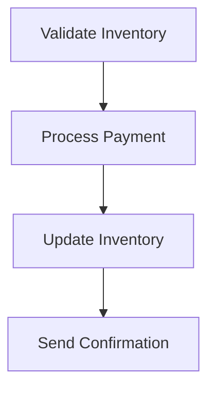

# E-Commerce Order Processing: Temporal Assessment

## Objective
Compare manual vs. Temporal implementations of an order processing system:
- **Original**: Fragile Python script with manual retries
- **Improved**: Resilient Temporal workflow

## Key Differences
| Feature          | Original           | Temporal           |
|------------------|--------------------|--------------------|
| Retries          | Manual loops       | Built-in policies  |
| Durability       | Lost on crash      | Automatic recovery |
| Error Handling   | Nested try-catch   | Activity-level     |
| Visibility       | Log files          | Temporal UI        |

## Process Flow

## Original Implementation Challenges


Pain Points:

- 🧩 Business logic mixed with retry plumbing
- 💥 No recovery if process crashes after payment
- 🔍 Difficult to debug partial failures
- 🤹 Manual state tracking (e.g., txn_id variables)

## Temporal Implementation Benefits
Code Example:

```python
# Declarative activity execution
await workflow.execute_activity(
    process_payment,
    retry_policy=RetryPolicy(
        initial_interval=timedelta(seconds=1),
        maximum_attempts=3
    )
)
```
### Advantages:

- ✨ Clean separation of business logic
- 🔄 Automatic crash recovery
- 📊 Full execution history in UI
- ⏱️ Built-in timeouts and retries


## How to Run
### Original Version:

```bash
python order_processor.py
``` 


### Temporal Version:

**Prerequisites**
1. Temporal Server: Ensure a Temporal server is running (e.g., using Docker Compose).
2. Dependencies: Install the Temporal Python SDK 
3. Python Environment: Python 3.10+ is recommended.


```bash
# Start worker (Terminal 1)
python run_worker.py

# Trigger workflow (Terminal 2)
python run_workflow.py
```
Access Temporal UI: http://localhost:8233


This README provides a high-level overview. For detailed code implementation, refer to workflows.py, activities.py, run_worker.py, and run_workflow.py in this repository.
